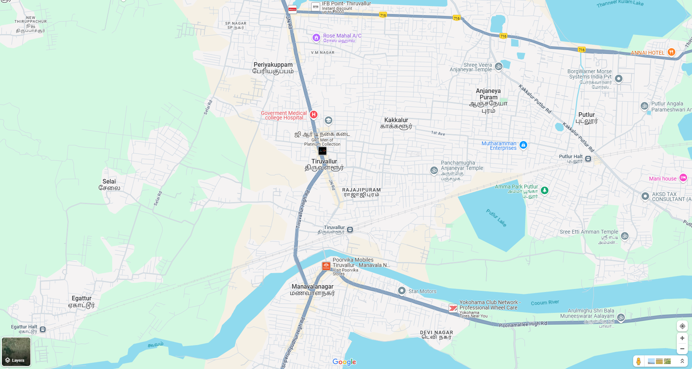

# Ex04 Places Around Me
## Date: 26.11.2024

## AIM
To develop a website to display details about the places around my house.

## DESIGN STEPS

### STEP 1
Create a Django admin interface.

### STEP 2
Download your city map from Google.

### STEP 3
Using ```<map>``` tag name the map.

### STEP 4
Create clickable regions in the image using ```<area>``` tag.

### STEP 5
Write HTML programs for all the regions identified.

### STEP 6
Execute the programs and publish them.

## CODE
```
map.html

<html>
<head>
<title>My City</title>
</head>
<body>
<h1 align="center">
<font color="red"><b>TIRUVALLUR</b></font>
</h1>
<h3 align="center">
<font color="blue"><b>G.T.GOWTHAM (24901330)</b></font>
</h3>
<center>
    
    <map name="image-map">
        <area target="" alt="tiruvallur" title="tiruvallur" href="tiruvallur.html" coords="762,404,927,465" shape="rect">
        <area target="" alt="manavalanagar" title="manavalanagar" href="manavalanagar.html" coords="823,761,89" shape="circle">
        <area target="" alt="Egattur" title="Egattur" href="Egattur.html" coords="141,756,300,833" shape="rect">
        <area target="" alt="temple" title="temple" href="temple.html" coords="1176,158,1345,196" shape="rect">
        <area target="" alt="medicalhospital" title="medicalhospital" href="medicalhospital.html" coords="685,293,809,320" shape="rect">
    </map>  
</center>
</body>
</html>

Egattur.html

<html>

<head>

<title>My Home Town</title>

</head>

<body bgcolor="orange">

<h1 align="center">

<font color="red"><b>TIRUVALLUR</b></font>

</h1>

<h3 align="center">

<font color="blue"><b>Egattur</b></font>

</h3>

<hr size="3" color="red">

<p align="justify">

<font face="Georgia" size="5">

    Egattur is a neighbourhood in Chennai, India. It is a village in Tiruvallur district of Tamil Nadu, located on the western outskirts of Chennai. In the 2011 census it had a population of 4842 in 1251 households..</font>

</p>

</body>

</html>

manavalanagar.html

<html>

<head>

<title>My Home Town</title>

</head>

<body bgcolor="cyan">

<h1 align="center">

<font color="red"><b>TIRUVALLUR</b></font>

</h1>

<h3 align="center">

<font color="blue"><b>manavalanagar</b></font>

</h3>

<hr size="3" color="red">

<p align="justify">

<font face="Georgia" size="5">

    Manavalanagar is a locality in Tiruvallur, Tamil Nadu, India: 
    Location
    Manavalanagar is a hub for businesses in the retail, manufacturing, and service industries. It's also a passway for travelers between Chennai and Tiruvallur. 
    Connectivity
    Manavalanagar is well connected to schools, colleges, hospitals, banks, and markets. It's also close to the Tiruvallur bus stand and the Tirutani Highways. 
    Nearby attractions
    Manavalanagar is near the Manavalan Nagar Police Station, sub registrar office, and a railway station. 
    Nearby companies
    Manavalanagar is home to companies like Caterpillar, Citroen Automobiles, Hindustan Motors, and more. .</font>

</p>

</body>

</html>

medicalhospital.html
<html>

<head>

<title>My Home Town</title>

</head>

<body bgcolor="lime">

<h1 align="center">

<font color="red"><b>TIRUVALLUR</b></font>

</h1>

<h3 align="center">

<font color="blue"><b>government medical hospital</b></font>

</h3>

<hr size="3" color="red">

<p align="justify">

<font face="Georgia" size="5">

    Government General Hospital is a dedicated hospital in Kakkalur, Tiruvallur, that offers high-quality healthcare services to patients of all ages. The hospital's team of professionals is highly skilled and well-versed in their respective domains..</font>

</p>

</body>

</html>

temple.html
<html>

<head>

<title>My Home Town</title>

</head>

<body bgcolor="yellow">

<h1 align="center">

<font color="red"><b>TIRUVALLUR</b></font>

</h1>

<h3 align="center">

<font color="blue"><b>anjanayer temple</b></font>

</h3>

<hr size="3" color="red">

<p align="justify">

<font face="Georgia" size="5">

    The Presiding Deity of this Temple is Lord Hanuman who Blesses His Devotees as Veera Anjanayer. This Temple is built in Kakkalur village in Thiruvallur District. Though the Temple is quite simple and compact the power of this God is immense and hence there is a steady flow of Devotees not only from Thiruvallur District but from the neighboring Chennai City, Kanceepuram and Chengalpet Districts too. There is a continious chanting of Rama Naamam in this Temple. There are quite a few shops selling flowers, garlands and other divine Pooja Items. There is a Sub Shrine for Lord Vinayaka too.</font>

</p>

</body>

</html>

tiruvallur.html
<html>

<head>

<title>My Home Town</title>

</head>

<body bgcolor="blue">

<h1 align="center">

<font color="red"><b>TIRUVALLUR</b></font>

</h1>

<h3 align="center">

<font color="blue"><b>MY HOME</b></font>

</h3>

<hr size="3" color="red">

<p align="justify">

<font face="Georgia" size="5">
    
    It is a satellite town of Chennai and is the administrative headquarters of Tiruvallur District. The town is known for the Veeraraghava Swamy Temple, one of the 108 sacred shrines of Vaishnavites. The tank festival is held at a pond near this temple. A Shiva temple near this shrine which is popular among the locals.Poondi Reservoir (later named as Sathyamoorthy Sagar) was constructed in 1944 across the Kosathalaiyar River or Kotralai River in Thiruvallur district with a capacity of 2573 Mcft and placed in service for intercepting and storing Kosathalaiyar River water. Surplus water flows down the river which is again intercepted by Tamaraipakkam Anicut and diverted to Sholavaram Lake and Puzhal lake. A lined canal known as Poondi Canal was later constructed in 1972 to convey water from Poondi Reservoir to Sholavaram Lake. This reservoir was constructed at the cost of ₹ 6.5 million. Satyamurti who is remembered today as the political mentor of Kumaraswami Kamaraj, who was the Chief Minister of the State between 1954 and 1963. Because of his strong devotion to Satyamurti, Kamaraj got the Poondi reservoir named after Satyamurti.</font>

</p>

</body>

</html>

```

## OUTPUT!


## RESULT
The program for implementing image maps using HTML is executed successfully.
